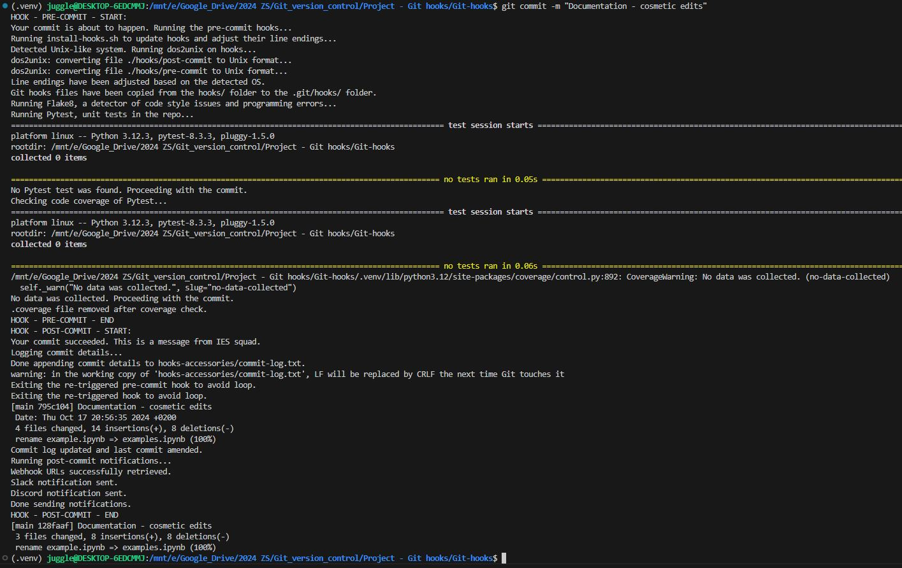

# Git-hooks (JEM224)

## 🔎 About

This repository is a project from the IES course **JEM224 - Version control with Git**. Its purpose is to get a closer look at **Git Hooks**, with some general theory and an example of their use further with live implementation of *pre-commit* and *post-commit*.

## 👥 Authors 

The contributors to this project are:

- [@MichalS16](https://github.com/MichalS16) - Michal Smieško
- [@mrkoubek](https://github.com/mrkoubek) - David Koubek

## 📚 Content 

The general theory about **Git Hooks** is in:
[Theory](https://github.com/MichalS16/Git-hooks/blob/main/theory.md)

The demonstration of setting up **Git Hooks** is in:
[Examples](https://github.com/MichalS16/Git-hooks/blob/main/examples.ipynb)

## 🎣 Hooks

Our *pre-commit* and *post-commit* hook scripts are implemented in this repo and output the following actions in the terminal when making a commit:

